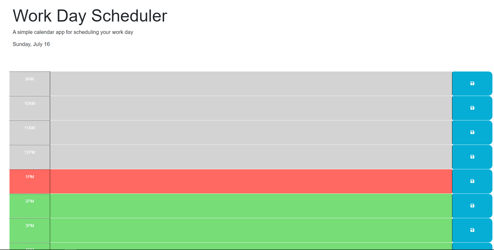

# Day Planner

This challenge is for the fifth week of UMO coding bootcamp.

## Objective

The purpose of this challenge was to utilize the JQuery and Bootstrap we have learned throughout the week to add upon our existing knowledge of Javascript and DOM manipluation. This is a day planner for the standard 9AM-5PM day that allows the user to enter tasks to keep themselves organized and will stay when the page is closed or reloaded. Past hours are shown in gray, current hour shown in red, future hours shown in green.

[Deployed site](https://rodrjavi.github.io/day-planner/)
